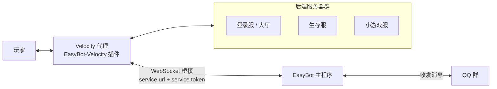

<p align="center">
  
</p>

<h1 align="center">EasyBot-Velocity</h1>

<p align="center">EasyBot 的 Velocity 代理端桥接插件：把 Velocity 群组服接入 EasyBot 主程序，实现 QQ 群与游戏内的双向消息互通、账号绑定、代理端登录联动等能力。</p>

<p align="center">
  <a href="https://github.com/easybot-team/Easybot-Velocity/releases"></a>
  
  
</p>

<p align="center">
  <a href="#功能">功能</a> ·
  <a href="#工作方式">工作方式</a> ·
  <a href="#运行环境">运行环境</a> ·
  <a href="#可选联动插件">可选联动插件</a> ·
  <a href="#安装">安装</a> ·
  <a href="#命令与权限">命令与权限</a> ·
  <a href="#配置说明">配置说明</a> ·
  <a href="#从源码构建">从源码构建</a> ·
  <a href="#项目结构">项目结构</a> ·
  <a href="#相关项目">相关项目</a> ·
  <a href="#相关链接">相关链接</a>
</p>

---

## 功能

- **账号绑定**：代理端 `/easybot bind` 生成验证码，群内发送「绑定 #code」完成绑定
- **消息同步**：群与群组服双向同步，支持 `@` 提醒、`/esay` 主动发消息
- **玩家事件**：子服切换、代理端加入 / 退出等事件同步到群
- **代理端登录联动**：AuthMeVelocity（代理端登录）、LimboAuth（Limbo 登录服）、LibreLogin 登录状态判定，在代理层拦截未登录玩家
- **皮肤**：SkinsRestorer 皮肤 API 支持（代理端获取与设置皮肤）
- **基岩版**：Geyser + Floodgate，支持基岩版玩家名前缀处理与识别
- **命令执行**：通过 WebSocket 接收主程序下发的命令，在代理端执行

## 工作方式



- 插件安装在 Velocity 代理端，通过 WebSocket 长连接与 **EasyBot 主程序**通信，由主程序负责与 QQ 群收发消息
- 主程序下发命令时，插件在代理端执行
- 玩家在群组服间的切换、加入、退出等事件由插件上报，群消息与游戏消息双向同步
- **与 EasyBot-Bukkit 的区别**：Velocity 版本运行在代理层，可统一管理整个群组服的通信，无需在每个子服重复安装

## 运行环境

| 项目 | 要求 |
| --- | --- |
| Java | **21 及以上** |
| 代理端 | Velocity **3.4.0** |
| 前置 | **EasyBot 主程序**（提供 `ws://` 桥接地址与服务器 token） |

> [!NOTE]
> 插件编译目标为 **Java 21**，需配合 Velocity 3.4.0 运行。

## 可选联动插件

| 插件 | 作用 | 备注 |
| --- | --- | --- |
| [AuthMeVelocity](https://github.com/4drian3d/AuthMeVelocity) | 代理端登录拦截 | 配合后端 AuthMe 使用 |
| [LimboAuth](https://github.com/Elytrium/LimboAuth) | Limbo 登录服认证 | 拦截未登录玩家到 Limbo 服 |
| [LibreLogin](https://github.com/kyngs/LibreLogin) | 登录状态判定 | |
| [SkinsRestorer](https://github.com/SkinsRestorer/SkinsRestorer) | 玩家皮肤 | 代理端获取 / 设置皮肤 |
| [Geyser](https://geysermc.org/) + [Floodgate](https://geysermc.org/) | 基岩版玩家 | 基岩版玩家名前缀处理 |

## 安装

1. 从 [Releases](https://github.com/easybot-team/Easybot-Velocity/releases) 下载最新版本 jar（当前最新 **v1.3.0**）
2. 把 jar 放进 Velocity 代理端的 `plugins/` 目录
3. 启动一次 Velocity，生成 `plugins/easybot-velocity/config.yml`，填入主程序里创建的 **桥接地址** 与 **token**
4. 重启 Velocity，或在代理端执行 `/easybot reload`

> [!IMPORTANT]
> 配置中可设置连接失败时的处理策略。若需在断连时阻止玩家登录（白名单场景），请确保 `ignore_error` 为 `false`。

## 命令与权限

| 命令 | 说明 | 权限 |
| --- | --- | --- |
| `/easybot bind` | 生成绑定验证码 | `easybot.command.bind` |
| `/easybot reload` | 重载配置（仅管理员 / 控制台） | 管理员 |
| `/esay <消息>` | 以玩家身份把消息发到群里 | `easybot.command.esay` |

## 配置说明

配置文件位于 `plugins/easybot-velocity/config.yml`，改完可以用 `/easybot reload` 热重载。

| 配置项 | 说明 |
| --- | --- |
| `service.url` / `service.token` | EasyBot 主程序提供的桥接地址与服务器 token |
| `debug` | 调试日志（反馈问题时建议开启） |
| `service.ignore_error` | 连不上主程序时是否放行玩家登录 |
| `message.*` | 绑定相关提示文本 |

## 从源码构建

```bash
./gradlew build
# 产物：build/libs/EasyBot-Velocity-<version>.jar
```

- 编译使用 **JDK 21 toolchain**（Gradle 会自动下载或用本机 JDK 21）
- 依赖 `com.github.easybot-team:easybot-bridge` 从 **JitPack** 自动拉取，无需额外配置

## 项目结构

```
src/main/java/org/lby123165/easyBotVelocity/
├── EasyBotVelocity.java         主类与插件入口
├── VelocityBridgeBehavior.java  WebSocket 桥接行为实现
├── commands/
│   └── EasyBotCommand.java      /easybot、/esay 命令
├── config/
│   └── Configuration.java       配置管理
├── hooks/
│   └── VelocityEventListener.java  事件监听（加入、退出、子服切换等）
├── sender/
│   └── ...                      消息发送
└── utils/
    ├── GeyserUtils.java         基岩版玩家工具
    └── SkinUtils.java           皮肤工具
```

## 发布流程

- 推送到 `master` 后由 GitHub Actions 自动构建
- 在 GitHub 发布 Release 后由 Actions 构建并上传 jar 资产

## 相关项目

同一组织下还有其它端的实现，配置与功能保持一致：

| 项目 | 说明 |
| --- | --- |
| [easybot-bridge](https://github.com/easybot-team/easybot-bridge) | 主程序与服务器的通信协议（本插件的依赖） |
| [easybot-bukkit](https://github.com/easybot-team/easybot-bukkit) | Bukkit / Spigot / Paper 服务端版本 |
| [easybot-mod](https://github.com/easybot-team/easybot-mod) | Mod 端实现 |
| [easybot-mcdr](https://github.com/easybot-team/easybot-mcdr) | MCDR 群服同步插件 |
| [easybot-legacyforge](https://github.com/easybot-team/easybot-legacyforge) | 社区项目：Forge 1.12.2 版本 |
| [EzbotSup](https://github.com/easybot-team/EzbotSup) | 一键安装 / 部署工具 |
| [easybot-issues](https://github.com/easybot-team/easybot-issues) | 各端问题的统一收集仓库（**请在这里反馈问题**） |

## 相关链接

> [!TIP]
> 遇到 Bug 或想提功能建议，请到 **[easybot-issues](https://github.com/easybot-team/easybot-issues/issues/new/choose)** 提交（官方统一收集各端问题）。
> 附上代理端版本、插件版本，并把 `config.yml` 里的 `debug` 设为 `true` 后复现一次、附上后台日志，定位会快很多。

- 使用文档：<https://docs.inectar.cn/>
- 上游仓库：<https://github.com/easybot-team/Easybot-Velocity>
- 问题反馈：[easybot-team/easybot-issues](https://github.com/easybot-team/easybot-issues/issues)
- Logo 素材：取自同组织的 [easybot-mod](https://github.com/easybot-team/easybot-mod) 模组图标

---

<p align="center"><sub>EasyBot-Velocity · 使用文档 <a href="https://docs.inectar.cn/">docs.inectar.cn</a> · 问题反馈 <a href="https://github.com/easybot-team/easybot-issues/issues">easybot-issues</a> · 由 <a href="https://github.com/easybot-team">easybot-team</a> 维护</sub></p>
